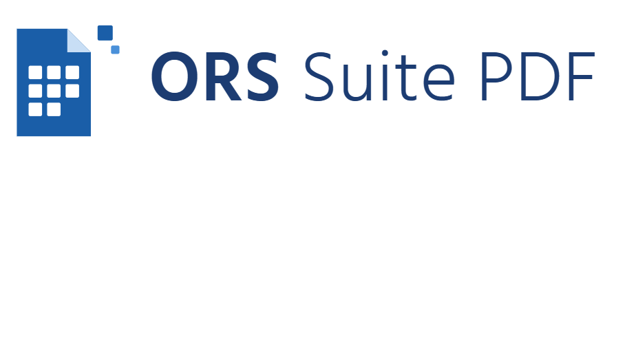

<p align="center">
  
</p>

<p align="center">
  <strong>Editor de PDF profesional para Windows · offline-first · gratuito</strong>
</p>

<p align="center">
  <a href="https://github.com/davidmorrom/ORSSuitePDF/releases/latest">
    
  </a>
</p>

## ⬇️ Descargar

Descarga el instalador de Windows desde la página de
**[Releases](https://github.com/davidmorrom/ORSSuitePDF/releases/latest)** —
no necesitas el código fuente. Ejecuta el `.exe`; incluye todo lo necesario
(Java embebido y datos de OCR), no hay que instalar nada más.

> **Nota:** al no llevar certificado de firma de código, Windows SmartScreen
> puede mostrar un aviso la primera vez. Pulsa **Más información → Ejecutar de
> todos modos**. No afecta a la instalación ni al uso.

Requisitos: Windows 10/11 (64 bits).

## Copyright
© 2026 David — ORS Consulting. Todos los derechos reservados.

Este repositorio se publica con fines de portfolio/demostración. No se
concede ninguna licencia de uso, copia, modificación o distribución sobre
este código. Ver un repositorio público en GitHub no implica autorización
para reutilizarlo fuera de la propia plataforma. Si quieres usar parte de
este código, contacta antes con el autor.

---

Unir, dividir, rotar, marcadores, formularios, anotaciones, firma digital
con validez legal (PAdES), edición de texto existente y OCR.

## Coste: 100% gratuito
Todas las librerías del stack (Java, JavaFX, AtlantaFX, Apache PDFBox,
DSS, Tess4J, Maven, jpackage) son open-source y gratuitas, sin coste de
licencia. La única excepción, totalmente opcional, es un certificado de
firma de código (~€100-300/año) para evitar el aviso de Windows
SmartScreen al distribuir el instalador — no es necesario para
desarrollar ni usar la app.

## Requisitos
- JDK 21+
- Maven 3.9+ (opcional: el proyecto incluye Maven Wrapper, `./mvnw`)
- Para compilar el instalador en Windows: WiX Toolset

## Desarrollo
```
./mvnw clean javafx:run     # o mvn clean javafx:run si Maven está instalado
./mvnw test                 # ejecuta las pruebas
```

## OCR (datos de idioma)
El OCR usa Tesseract a través de Tess4J, cuyos binarios nativos ya van
incluidos: **no hace falta instalar Tesseract**. Solo se necesitan los datos
de idioma (`*.traineddata`), que no se versionan por tamaño. Descárgalos una
vez en la carpeta `tessdata/` (o apunta la variable `TESSDATA_PREFIX` a otra):
```
mkdir tessdata
curl -L --ssl-no-revoke -o tessdata/eng.traineddata \
  https://github.com/tesseract-ocr/tessdata_fast/raw/main/eng.traineddata
curl -L --ssl-no-revoke -o tessdata/spa.traineddata \
  https://github.com/tesseract-ocr/tessdata_fast/raw/main/spa.traineddata
```
Es una descarga única de configuración; el reconocimiento funciona sin
conexión. Al empaquetar, incluye la carpeta `tessdata/` junto a la app.

## Empaquetado

Primero se genera el JAR con dependencias (fat jar). Su clase principal es
`…core.Launcher` (no extiende `Application`), lo que permite ejecutarlo con
`java -jar` y empaquetarlo con jpackage.

```
./mvnw clean package
```

Luego se prepara una carpeta de _staging_ con el fat jar y los datos de OCR
(jpackage copia todo el contenido de `--input` junto a la app):
```
rmdir /s /q target\stage 2>nul & mkdir target\stage
copy target\ors-suite-pdf-0.1.0.jar target\stage\
xcopy /e /i tessdata target\stage\tessdata
```

### Instalador .exe (requiere WiX)
La forma recomendada es el script, que encapsula todos los parámetros:
```
scripts\package-windows.cmd 1.0.1
```
Genera `target\installer\ORS Suite PDF-<version>.exe`. El instalador lleva un
**UpgradeCode fijo**, así que un instalador con una **versión superior
actualiza en su sitio** al ya instalado (sin desinstalar); por eso hay que
subir la versión en cada release.

Detalle del comando que ejecuta el script (necesita **WiX Toolset 3.x**,
`choco install wixtoolset`). Usa `--runtime-image` apuntando a un JDK completo
para incluir los proveedores criptográficos `jdk.crypto.mscapi` (almacén de
Windows) y `jdk.crypto.cryptoki` (DNIe/PKCS#11), que la firma necesita y que el
jlink por defecto omite; `-Dtessdata.dir=$APPDIR\tessdata` localiza el OCR:
```
jpackage --type exe ^
  --name "ORS Suite PDF" ^
  --input target/stage ^
  --main-jar ors-suite-pdf-0.1.0.jar ^
  --main-class com.orsconsulting.orssuitepdf.core.Launcher ^
  --runtime-image "C:\Program Files\Eclipse Adoptium\jdk-25.0.3.9-hotspot" ^
  --app-version 1.0.0 --vendor "ORS Consulting" ^
  --description "Editor de PDF profesional offline-first" ^
  --dest target/installer ^
  --win-upgrade-uuid b23ad378-22ac-4b04-a9b4-fb3fd3f74db0 ^
  --java-options "--enable-native-access=ALL-UNNAMED" ^
  --java-options "-Dtessdata.dir=$APPDIR\tessdata" ^
  --win-shortcut --win-menu --win-dir-chooser
  REM opcional: --icon build/icon.ico
```
El instalador queda en `target/installer/ORS Suite PDF-1.0.0.exe`.

### App portable (sin WiX)
Misma orden cambiando `--type exe` por `--type app-image`: genera una carpeta
ejecutable con su propio runtime en `target/installer/ORS Suite PDF/`, sin
instalador. (En macOS/Linux, usar `--type dmg`/`deb`/`app-image`.)

Nota: sin certificado de firma de código, Windows SmartScreen puede
mostrar un aviso al ejecutar el instalador por primera vez — no afecta a
la instalación ni al uso de la app una vez instalada.

## Estructura
Ver las decisiones de arquitectura documentadas en `docs/adr/`.

## Roadmap
1. ✅ MVP: visor PDF (navegación + zoom), unir/extraer, rotar/mover/eliminar
   páginas y editor de marcadores (PDFBox + JavaFX)
2. ✅ Formularios (AcroForms): leer/rellenar/aplanar campos + inserción de
   imagen/sello visual sobre la página
3. ✅ OCR de páginas (Tess4J, offline) + inserción de texto sobre la página
4. ✅ Firma PAdES con DSS (backend OpenPDF, ver ADR-003) y fallback
   online/offline: PAdES-B-T con sello de tiempo o PAdES-B sin conexión
5. ✅ Empaquetado a instalador Windows (.exe) con jpackage + WiX

### Extras
- ✅ Visor con **desplazamiento vertical continuo** y **panel de miniaturas**
   con reordenación por arrastre.
- ✅ **Gestor de pestañas**: varios PDF abiertos a la vez, uno por pestaña.
- ✅ **Firma con el almacén de Windows** (certificados instalados y **DNIe**);
   el PIN lo solicita el sistema. Opción de **firma visible** dibujando el
   recuadro sobre la página. **Validación** de firmas existentes.
- ✅ **Unir** con pantalla de revisión (ordenar/quitar/añadir documentos).
- ✅ **Impresión** con diálogo nativo (impresoras y Microsoft Print to PDF).
- ✅ **Exportar** a texto e imágenes (nativo) y a DOCX/PPTX/ODT/RTF vía
   LibreOffice si está instalado (ver ADR-004).
- ✅ **Redacción segura** (elimina el contenido de verdad), **anotaciones**
   (resaltar/recuadro/nota), **buscar texto** (Ctrl+F), **proteger con
   contraseña**, **marca de agua** y **numeración**.
- ✅ **Archivos recientes**, **arrastrar y soltar** para abrir, y memoria de
   la última carpeta usada.

La firma usa el almacén de certificados de Windows (incluido el DNIe al
insertar la tarjeta). Ningún certificado ni clave se versiona (ver
`.gitignore`).
